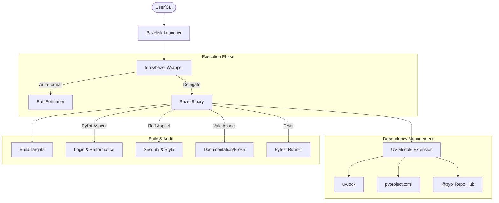

# Build Architecture & Design

This document provides a comprehensive overview of the build system architecture for the `bazel-python-hermetic-blueprint` project.

## Core Philosophy
The build system is designed around three pillars:
1. **Hermeticity**: Ensuring builds are reproducible by isolating the execution environment.
2. **Developer Velocity**: Automating repetitive tasks like formatting and linting to reduce manual overhead.
3. **Security**: Integrating automated security audits directly into the local build and CI lifecycle.

## High-Level Architecture

The following diagram illustrates the interaction between the user CLI, the Bazel wrapper, dependency management via `uv`, and the various audit/test targets.

## Critical Components

### 1. The Launcher: Bazelisk
The project uses **Bazelisk** to manage Bazel itself. It ensures that every developer and the CI environment use the exact version of Bazel specified in the [`.bazelversion`](.bazelversion) file, preventing "it works on my machine" issues caused by version mismatches.

### 2. The Interceptor: `tools/bazel`
The [`tools/bazel`](tools/bazel) script is a wrapper that intercepts all commands before they reach the Bazel binary.
- **Local Development**: It automatically triggers code formatting via Ruff before executing `build`, `test`, or `run` commands.
- **CI/CD Safety**: It detects CI environments (GitHub Actions) and disables automatic modifications to ensure the build remains immutable and verifiable.

### 3. Dependency Management: `uv`
Python dependencies are resolved and locked using [uv](https://github.com/astral-sh/uv).
- **Workflow**: Dependencies are defined in [`pyproject.toml`](pyproject.toml) and pinned in [`uv.lock`](uv.lock).
- **Bazel Integration**: The `uv` module extension (provided by `aspect_rules_py`) ingests the lockfile and exposes packages as standard Bazel targets under the `@pypi` hub.

## Audit & Quality Control

The project employs a multi-layered approach to code quality and security.

### Linting via Aspects
Linting is decoupled from the main build graph using Bazel Aspects defined in [`tools/lint/linters.bzl`](tools/lint/linters.bzl). This allows audits to run in parallel without affecting the compilation or execution of the libraries themselves.
- **Pylint**: Used for deep logical analysis and performance audits.
- **Ruff**: Handles style enforcement and fast security checks.
- **Vale**: Used for Markdown linting and prose style enforcement.

### Security Auditing (Bandit)
Security is enforced via **Ruff-Bandit**, which is integrated into the standard linting workflow for immediate developer feedback. This ensures that security checks are run automatically during `bazel build --config=lint //...`.

### Markdown Quality Control
Markdown files are linted using **Vale** to ensure documentation standards are met.
1. **Linting Aspect**: Integrated into the standard linting workflow via `linters.bzl`. It runs automatically during `bazel build --config=lint //...`.
2. **Hermeticity**: Vale binaries are managed as external repositories and selected based on the execution platform using Bazel's `select` mechanism.

## Infrastructure Dependencies

| Rule Set | Description | Documentation |
| :--- | :--- | :--- |
| [**aspect_rules_py**](https://github.com/aspect-build/rules_py) | Advanced Python rules and `uv` integration. | [Link](https://github.com/aspect-build/rules_py) |
| [**aspect_rules_lint**](https://github.com/aspect-build/rules_lint) | Decoupled linting and formatting framework. | [Link](https://github.com/aspect-build/rules_lint) |
| [**rules_python**](https://github.com/bazelbuild/rules_python) | Standard Bazel Python toolchain support. | [Link](https://github.com/bazelbuild/rules_python) |
| [**aspect_bazel_lib**](https://github.com/aspect-build/bazel-lib) | Essential utility library for Bazel. | [Link](https://github.com/aspect-build/bazel-lib) |

---
*For details on running these tools, refer to the [README.md](README.md).*
